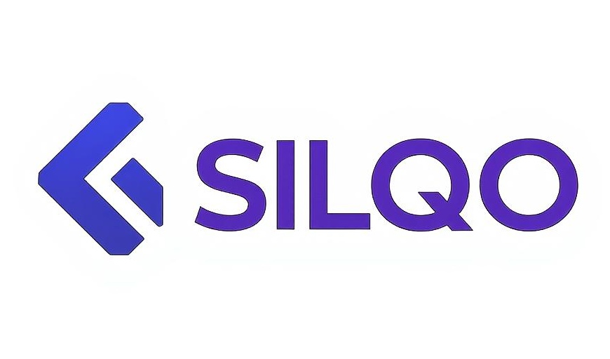
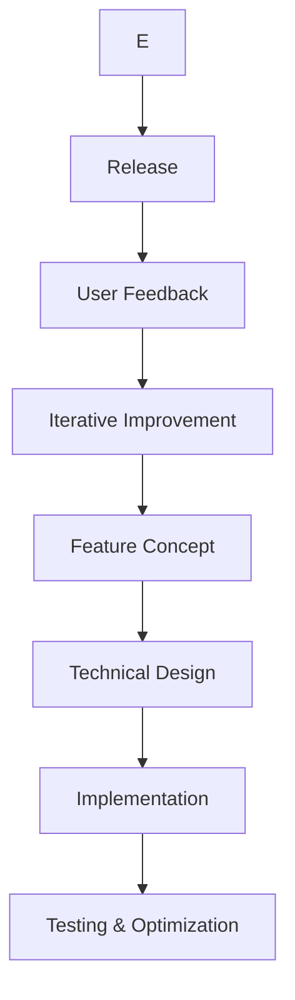

  <h1>🖼️ Silqo Team</h1>
  <h3>Advanced Browser-Based Image Optimization</h3>

  

## 🧠 Full Responsibility Scope

As the sole developer of Silqo, I handle all aspects of the project:

- **Application Architecture**: System design and technical planning  
- **Frontend Development**: HTML, CSS, JavaScript implementation  
- **Image Processing**: Compression algorithm development  
- **UI/UX Design**: Interface creation and user experience optimization  
- **Quality Assurance**: Cross-browser testing and performance optimization  
- **DevOps**: Deployment automation and server management  
- **Documentation**: Technical writing and user guides  
- **Product Strategy**: Feature roadmap and future planning  

## 🌟 Core Development Philosophy

1. **Privacy First**: Images never leave the user's browser — zero server uploads  
2. **Performance Focus**: Optimized algorithms for maximum speed and efficiency  
3. **Simplicity**: Intuitive user experience with minimal learning curve  
4. **Transparency**: Open source codebase with clear documentation  
5. **Accessibility**: Free service with no limitations or paywalls  

## 🛠️ Development Approach

## 🔧 Technical Expertise

**Languages:** JavaScript (ES6+), HTML5, CSS3  
**Frameworks:** Node.js, Express  
**Browser APIs:** Canvas, File, DOM, Web Workers  
**Development Tools:** Git, VS Code, Chrome DevTools, Webpack  
**Cloud Infrastructure:** Heroku, GitHub Actions  
**Design Tools:** Figma, Adobe Creative Suite  
**Testing:** Jest, BrowserStack  

## 🏆 Key Achievements

- Developed 4 distinct image compression algorithms from scratch  
- Created responsive UI with dark/light theme support  
- Implemented real-time visual comparison slider  
- Maintained 100% client-side processing architecture  
- Achieved average 40–70% image size reduction  
- Implemented multi-language support (English/Russian)  
- Reduced initial load time to under 1.5 seconds  
- Optimized memory usage for large image processing  

## 🤝 Collaboration Opportunities

While Silqo is currently a solo project, I welcome community participation through:

- **Bug Reports**: Via GitHub Issues  
- **Feature Suggestions**: Through GitHub Discussions  
- **Code Contributions**: Via Pull Requests  
- **Localization Help**: Adding new language translations  
- **Testing Support**: Cross-browser compatibility testing  
- **Documentation**: Improving tutorials and guides  

## 📬 Contact Information

  
  

  
  <h2>saykachi</h2>
  <h3>Founder & Lead Developer</h3>
  

    "Building powerful tools that respect user privacy and work for everyone, not just tech experts. Every image optimized with Silqo represents a faster, more accessible web."
  

  

    <a href="https://github.com/saykachi">GitHub</a> 
  

  © 2025 Silqo • All rights reserved

